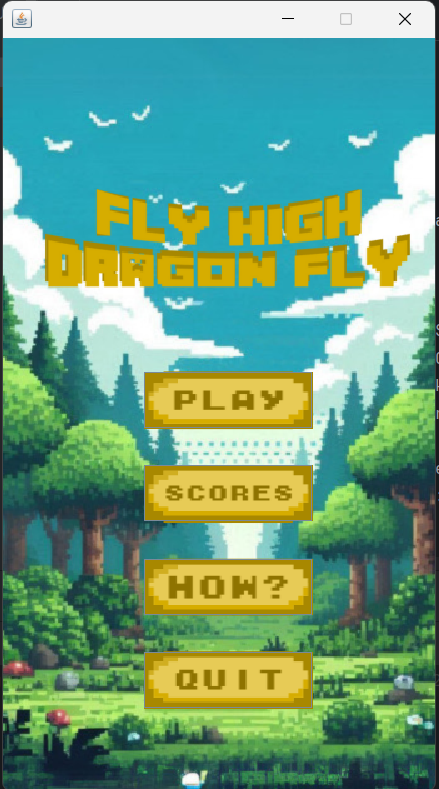

# Fly High Dragon Fly 🐉

A Java-based Flappy Bird clone featuring a dragon character, smooth animations, and progressive difficulty. Created as a Machine Problem project for CMSC 12.

## 📝 About

Fly High Dragon Fly is our creative take on the classic Flappy Bird game. Guide a dragon through pipes, collect points, and challenge yourself as the game progressively gets faster!

## 📸 Screenshots

<div align="center">

### Main Menu


### Gameplay in Action


### Game Over


</div>

## ✨ Features

- **Animated Dragon Sprite**: Smooth sprite-based animations for the dragon character
- **Progressive Difficulty**: Game speed increases every 10 seconds, reaching maximum speed
- **Dynamic Backgrounds**: Background transitions smoothly as you reach score milestones (5 and 12 points)
- **Score Tracking**: Save your high scores with name and date
- **Leaderboard System**: View all saved scores sorted by highest points
- **Pause & Resume**: Pause the game anytime during gameplay
- **Multiple Control Options**: Play using spacebar or mouse clicks

## 🎮 How to Play

1. **Start the Game**: Click the "Play" button from the main menu
2. **Control the Dragon**:
    - Press `SPACE` or `Click` to make the dragon fly up
    - Avoid hitting the pipes
    - Try to fly through as many pipe gaps as possible
3. **Pause**: Click the pause button (top-left) or press `SPACE` while paused to resume
4. **Game Over**:
    - View your score
    - Play again
    - Save your score to the leaderboard
    - Return to main menu

## 🎯 Gameplay Mechanics

- **Scoring**: Earn 0.5 points for each pipe successfully passed (1 point per pipe pair)
- **Speed Increase**: Every 10 seconds, pipe movement speed increases until reaching maximum
- **Background Changes**:
    - Default background: 0-4 points
    - Second background: 5-11 points
    - Third background: 12+ points

## 🚀 Getting Started

### Prerequisites
- Java Development Kit (JDK) 8 or higher
- Any Java IDE (Eclipse, IntelliJ IDEA, NetBeans, etc.) or command line

### Installation

1. Clone this repository:
```bash
git clone https://github.com/micxzie/Fly-High-Dragon-Fly.git
```

2. Navigate to the project directory:
```bash
cd Fly-High-Dragon-Fly
```

3. Compile and run:
```bash
javac src/MainMenu/Main.java
java src.MainMenu.Main
```

Or open the project in your preferred Java IDE and run `Main.java`

## 📁 Project Structure

```
Fly-High-Dragon-Fly/
├── src/
│   ├── MainMenu/
│   │   ├── Main.java                    # Entry point
│   │   ├── Menu.java                    # Main menu UI
│   │   ├── FlyHighDragonFly.java       # Main game logic
│   │   ├── ImageBackgroundPanel.java    # Custom panel for backgrounds
│   │   ├── Leaderboard.java            # Leaderboard display
│   │   ├── ScoreEntry.java             # Score data model
│   │   └── ScoreManager.java           # Score file management
│   └── img/                             # Game images and sprites
├── scores.txt                           # Saved scores (generated on first save)
└── README.md
```

## 🎨 Game Controls

| Action | Key/Mouse |
|--------|-----------|
| Fly Up | `SPACE` or `Left Click` |
| Pause | Pause Button (top-left) |
| Resume | `SPACE` (while paused) |
| Retry | Retry Button (top-left) |
| Main Menu | Menu Button (top-left or game over screen) |

## 🏆 Scoring System

- Each pipe pair passed = **1 point** (0.5 per pipe)
- Scores are saved with player name and date
- Leaderboard displays all scores in descending order

## 👥 Team Members

- **Merry Grace Potot** 
- **Marriane Balano**
- **Cueshe Adona**

## 📚 Course Information

- **Course**: CMSC 12 (Fundamentals of Programming 2)
- **Project Type**: Machine Problem
- **Academic Year**: 2024-2025

## 🛠️ Technologies Used

- Java Swing for GUI
- Java AWT for graphics and event handling
- File I/O for score persistence

## 📄 License

This project is created for educational purposes as part of CMSC 12 coursework.

## 🙏 Acknowledgments

- Inspired by the original Flappy Bird game by Dong Nguyen
- Created as a learning project for object-oriented programming concepts
- Thanks to our CMSC 11 instructor for guidance

---

**Enjoy playing Fly High Dragon Fly! 🐉🔥**